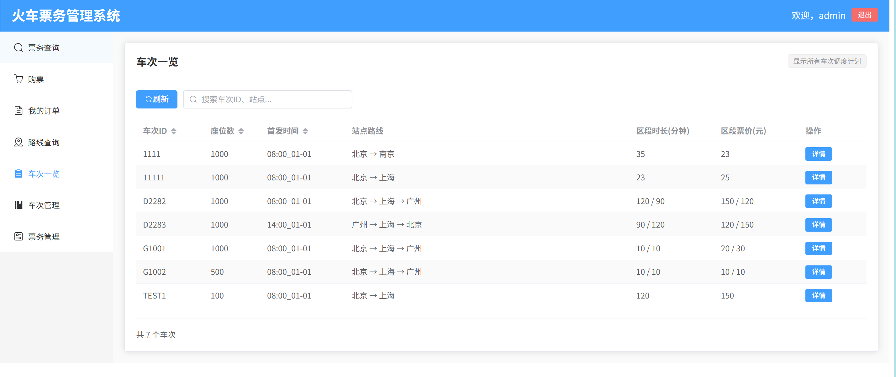
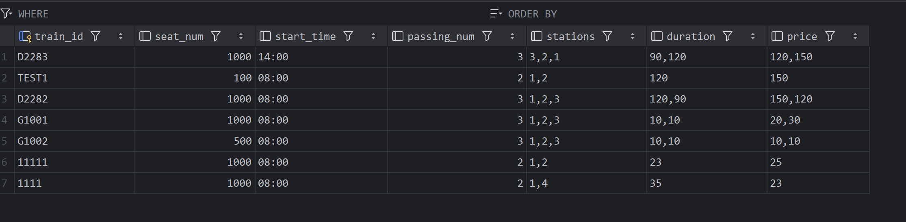
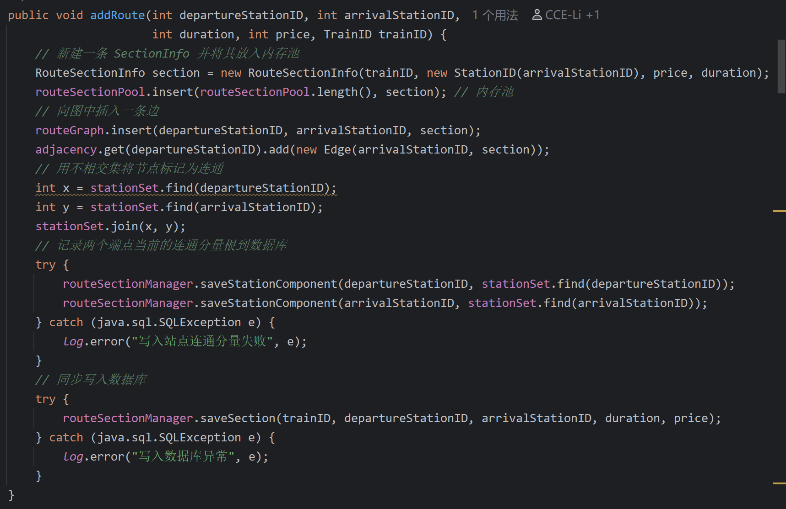
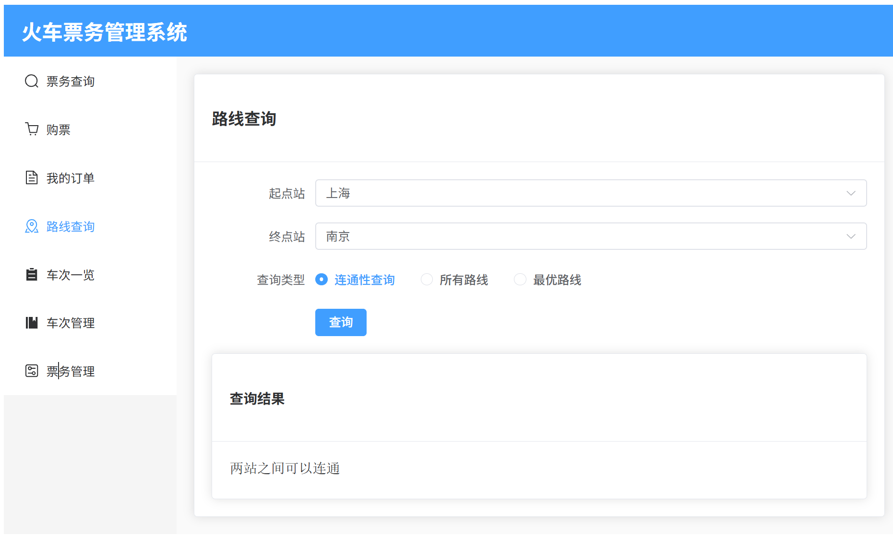
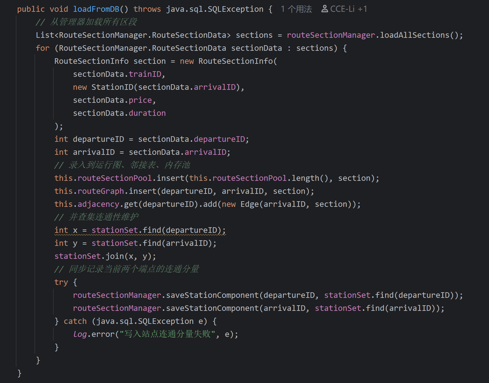
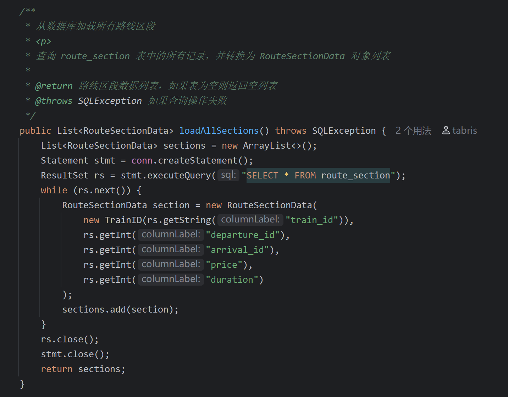
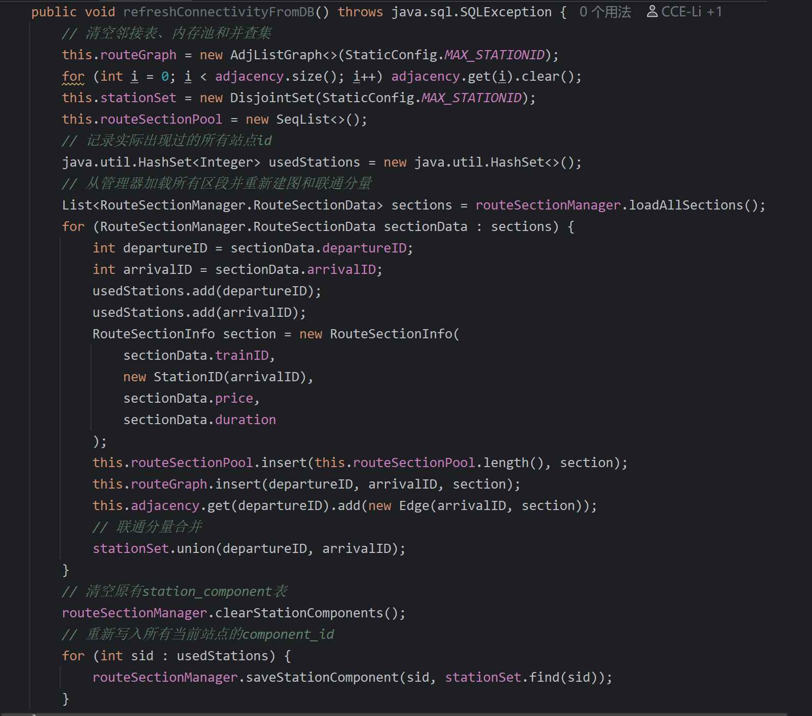
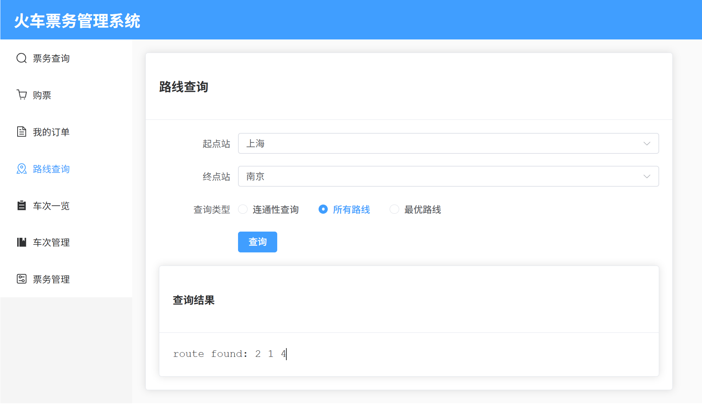
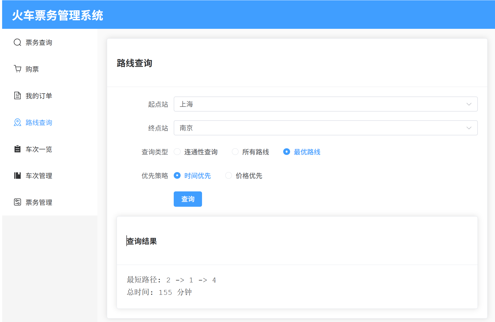
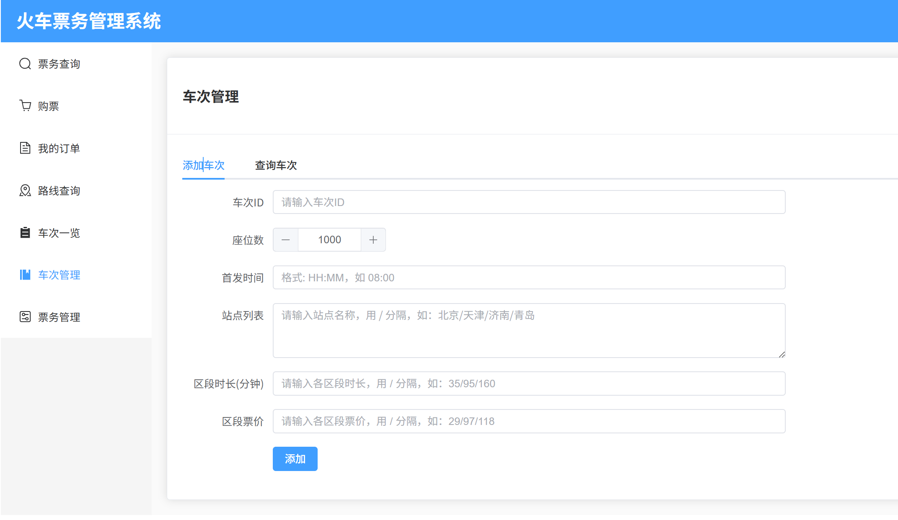

## 项目简介

---

# Train Scheduling Algorithm Overview

本文档梳理了列车调度系统中与“火车调度、路径计算与票务流程”相关的主要源文件、算法与职责，帮助快速定位各个功能的实现位置。

  

## 快速索引

| 子系统       | 关键文件                                                             | 功能摘要                                 | 主要算法/结构                                                                                                                                                |
| --------- | ---------------------------------------------------------------- | ------------------------------------ | ------------------------------------------------------------------------------------------------------------------------------------------------------ |
| 调度计划模型    | `util/TrainScheduler.java`                                       | 存储单车次全量调度信息（站序、时长、票价、首发时间等）并提供增删改查操作 | 固定数组+自定义操作、出发时间滚算 @src/main/java/boyuai/trainsys/util/TrainScheduler.java#51-291                                                                       |
| 调度计划持久化   | `manager/SchedulerManager.java`                                  | 负责 SQLite 中的调度计划 CRUD 与数组序列化         | 文本序列化/反序列化、INSERT OR REPLACE @src/main/java/boyuai/trainsys/manager/SchedulerManager.java#48-231                                                       |
| 路网建模与路径算法 | `core/RailwayGraph.java`                                         | 维护邻接图、连通性、所有可达路径与最短路                 | DFS、朴素 Dijkstra、并查集、邻接表缓存 @src/main/java/boyuai/trainsys/core/RailwayGraph.java#86-409                                                                 |
| 系统编排      | `core/trainsys.java`                                          | 权限校验、添加调度计划、同步路网、路线查询                | 业务编排、批量建边、校验逻辑 @src/main/java/boyuai/trainsys/core/trainsys.java#75-307                                                                             |
| Web 服务入口  | `service/TrainSystemService.java`, `controller/*.java`           | 将 REST 请求转换为核心系统调用                   | 参数校验、站点 ID 映射、偏好解析 @src/main/java/boyuai/trainsys/service/TrainSystemService.java#108-547                                                              |
| CLI 命令入口  | `util/CommandParser.java`                                        | 解析命令行的调度与路径指令                        | 字符串切分、站点/时间数组重建 @src/main/java/boyuai/trainsys/util/CommandParser.java#230-293                                                                         |
| 路线区段持久化   | `manager/RouteSectionManager.java`                               | 存储线路片段与站点连通分量                        | 表初始化、数据加载/重建 @src/main/java/boyuai/trainsys/manager/RouteSectionManager.java#65-186                                                                    |
| 票务与等待队列   | `manager/TicketManager.java`, `util/PrioritizedWaitingList.java` | 根据调度计划批量发售车票、维护优先队列                  | 批量插入、余票更新、优先队列 @src/main/java/boyuai/trainsys/manager/TicketManager.java#126-255 @src/main/java/boyuai/trainsys/util/PrioritizedWaitingList.java#15-96 |
| 基础数据结构    | `datastructure/*.java`                                           | 提供邻接表、并查集、优先队列等                      | DSU、邻接表、二叉堆等 @src/main/java/boyuai/trainsys/datastructure/DisjointSet.java#12-79 @src/main/java/boyuai/trainsys/datastructure/AdjListGraph.java#10-126 |

## 详细说明

### 1. 调度计划建模（`util/TrainScheduler.java`）

- **数据范围**：车次 ID、座位数、首发时间、经停站列表、区段时长/票价数组等。

- **算法点**：

  - 自定义 `addStation` / `insertStation` / `removeStation` / `findStation` 操作，围绕固定上限数组进行手动位移管理。

  - `getDepartureTimeAt` 根据首站时间与区段时长累加计算任意站点发车时刻，用于票务发售的时间对齐。@src/main/java/boyuai/trainsys/util/TrainScheduler.java#240-267

  

### 2. 调度计划持久化（`manager/SchedulerManager.java`）

- **职责**：在 `train_scheduler` 表中保存单车次全量调度数据；支持添加/查询/删除。

- **数据读取**：

  - `getScheduler` / `getAllSchedulers` 通过 JDBC `PreparedStatement` 从 SQLite 抽取车次记录，逐行反序列化站点序列、区段时长与票价，再构建 `TrainScheduler` 对象给上层调度/票务算法使用。@src/main/java/boyuai/trainsys/manager/SchedulerManager.java#122-213

  - `existScheduler` 以 `SELECT 1 FROM train_scheduler` 检查是否已有记录，阻止重复建图。@src/main/java/boyuai/trainsys/manager/SchedulerManager.java#105-113

- **关键逻辑**：

  - 通过 `joinIntArray` / `parseIntArray` 将站点、时长、票价数组转为逗号分隔文本。@src/main/java/boyuai/trainsys/manager/SchedulerManager.java#164-231

  - `addScheduler` 采用 `INSERT OR REPLACE` 避免主键冲突，配合业务层检查车次唯一性。@src/main/java/boyuai/trainsys/manager/SchedulerManager.java#77-96

  

### 3. 路网与路径算法（`core/RailwayGraph.java`）

- **路网构建**：`addRoute` 将区段写入邻接表、内存池并用并查集标记连通性。@src/main/java/boyuai/trainsys/core/RailwayGraph.java#103-128

- **连通性维护**：依赖 `DisjointSet` 判断站点可达性，并把根节点写入 `station_component`。@src/main/java/boyuai/trainsys/core/RailwayGraph.java#131-205

- **数据读取**：

  - 系统启动时 `loadFromDB` 向 `RouteSectionManager` 拉取全部区段记录（`SELECT * FROM route_section`），逐条转为 `RouteSectionInfo` 并重建邻接表、连通性，这些数据供 DFS/Dijkstra 即时查询。@src/main/java/boyuai/trainsys/core/RailwayGraph.java#317-358 @src/main/java/boyuai/trainsys/manager/RouteSectionManager.java#128-152

  - `refreshConnectivityFromDB` 重置内存结构后再次读取数据库，并同步写回连通分量。@src/main/java/boyuai/trainsys/core/RailwayGraph.java#375-408

- **路径算法**：

  1. `displayRoute`：基于 DFS 回溯枚举所有可能路线，输出所有路径。@src/main/java/boyuai/trainsys/core/RailwayGraph.java#146-208

  2. `shortestPath`：朴素 Dijkstra（`O(V²)`）计算价格或时间最优路线，支持路径回溯与代价输出。@src/main/java/boyuai/trainsys/core/RailwayGraph.java#213-315

- **数据重建**：`loadFromDB` / `refreshConnectivityFromDB` 用于将数据库区段重新载入图结构。@src/main/java/boyuai/trainsys/core/RailwayGraph.java#317-408

  

### 4. 核心系统编排（`core/trainsys.java`）

- **调度添加流程**：`addTrainScheduler` 先校验权限、站点 ID、数组长度，再调用 `SchedulerManager` 落库，最后对所有相邻站点调用 `RailwayGraph.addRoute` 建立区段。@src/main/java/boyuai/trainsys/core/trainsys.java#75-115

- **路线查询**：`findAllRoute`/`findBestRoute` 直接委托 `RailwayGraph` 的 DFS/Dijkstra 结果。@src/main/java/boyuai/trainsys/core/trainsys.java#300-307

- **票务交互**：`releaseTicket` / `queryRemainingTicket` 等方法将调度信息传递给 `TicketManager`，并结合 `PrioritizedWaitingList`、`TripManager` 驱动购票/退票流程。为满足购票算法需求，`queryRemainingTicket` 直接读取 `ticket_info` 中的座位数，`trySatisfyOrder` 在退票时再把 `TripManager.queryTrip` 的结果拉回内存校验。@src/main/java/boyuai/trainsys/core/trainsys.java#135-268

- **车次管理**:
- 

### 5. 服务与接口层

- **Web API**：`TrainSystemService` 负责解析 `AddTrainRequest`、站名转 ID、数组长度/时间格式校验，再调用 `trainsys.addTrainScheduler`。同时提供 `findAllRoute` / `findBestRoute` 的 REST 封装。@src/main/java/boyuai/trainsys/service/TrainSystemService.java#108-547

- **Controller**：`controller/TrainController.java`、`RouteController.java` 等实现 REST 入口，做 token 校验并转发到 Service。@src/main/java/boyuai/trainsys/controller/TrainController.java#22-49

- **命令行入口**：`util/CommandParser.java` 的 `parseAddTrain` 将 CLI 参数拆分为站点 ID、时长、票价、首发时间，最终复用 `trainsys.addTrainScheduler`；`parseBestPath` 切换时间/价格偏好后调用 `findBestRoute`。@src/main/java/boyuai/trainsys/util/CommandParser.java#230-293

  

### 6. 路线区段与票务底座

- **RouteSectionManager**：负责 `route_section` / `station_component` 表初始化、区段加载、站点连通分量保存与清空，是 `RailwayGraph` 持久化的桥梁。`loadAllSections`、`saveStationComponent` 等方法使用 JDBC `Statement/PreparedStatement` 读取或写入数据，为建图和并查集恢复提供输入。@src/main/java/boyuai/trainsys/manager/RouteSectionManager.java#65-186

- **TicketManager**：

  - `releaseTicket` 根据 `TrainScheduler` 逐区段生成 `ticket_info` 记录，并携带座位数/票价/时长。@src/main/java/boyuai/trainsys/manager/TicketManager.java#126-155

  - `querySeat` / `updateSeat` / `getDepartureTimes` 等通过 `PreparedStatement` 拉取余票或时间列表，直接供 `trainsys` 的购票/退票算法和前端展示使用。@src/main/java/boyuai/trainsys/manager/TicketManager.java#65-254

- **PrioritizedWaitingList**：使用自定义 `PriorityQueue` 包装 `PurchaseInfo`，在高压时段通过 `StaticConfig.BUSY_STATE_THRESHOLD` 判断是否繁忙。@src/main/java/boyuai/trainsys/util/PrioritizedWaitingList.java#15-96

  

### 7. 基础数据结构（`datastructure/*.java`）

- **AdjListGraph**：提供邻接表存储、插入/删除/存在性查询等基础能力，供 `RailwayGraph` 使用。@src/main/java/boyuai/trainsys/datastructure/AdjListGraph.java#10-126

- **DisjointSet**：实现路径压缩与按秩合并，为站点连通性检查提供近 O(1) 查询。@src/main/java/boyuai/trainsys/datastructure/DisjointSet.java#12-79

- **PriorityQueue / SeqList / LinkQueue**：分别支撑等待队列、DFS 路径缓存等操作（见 `datastructure` 目录）。

  

---

  

如需扩展调度算法，可根据上表快速定位对应层：

1. **新增调度属性** → 修改 `TrainScheduler` + `SchedulerManager` 序列化。

2. **优化路径算法** → 在 `RailwayGraph` 中替换/扩展 `shortestPath` 或新增策略；必要时同步更新 `trainsys` / `TrainSystemService` 的偏好枚举。

3. **新增接口** → 在 `TrainSystemService`/`controller` 添加 REST 入口，并复用核心系统能力。